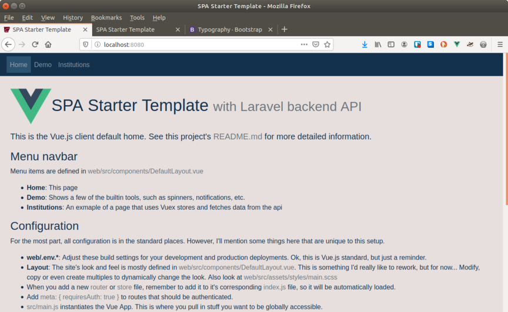

  
# SPA Starter Template

This is a template project with some basics scaffolding for building a Single
Page App (SPA) client with [Vue.js](https://vuejs.org/) and REST API backend with
[Laravel](https://laravel.com/).

This project is an outcome of some of my work at the
[Arkansas Research Center](https://arc.arkansas.gov)
and as such it has a few defaults we usually need, such as our logo and
copyright in the client's footer, etc. I've left them in because they
serve as useful placeholders for anyone.

The API uses:
* [Laravel 6.x](https://laravel.com/)
* [jwt-auth 1.0](https://github.com/tymondesigns/jwt-auth) for authentication
* [sqlite3](https://sqlite.org) as the default database

The web client uses:
* [Vue 2.6](https://vuejs.org/) (initially set up using [Vue CLI](https://cli.vuejs.org/)) with the following
  * Vue Router
  * Vuex
  * webpack
  * jest
  * eslint (using `@vue/standard` with a few custom rule overrides in `web/.eslintrc.js`)
  * sass
* [bootstrap-vue](https://bootstrap-vue.js.org/)
* [Axios](https://github.com/axios/axios) for API access
* [vue-notifications](https://github.com/euvl/vue-notification) for toast style notifications

This is **not** a beginner's template! You should be familiar with the components above and how they all work together.

As you can see by the directory structure, the api and web clients could easily
be separated into their own projects. It is certainly possible to build a web
SPA client entirely within the Laravel ecosystem, but I find separating the SPA
from it's API to be a good clean way to organize, develop, and test, and it
provides good flexibility for deployment.

## !!!! USE AT YOUR OWN RISK !!!!
This code is useful to me so I'm making it available to others, but I make no guarantees whatsoever.

## Screenshot of client



## Cloning

You can clone/fork/copy/download this project any way you like. However, you
probably don't want any of my branches, commit history, etc. so I would
recommend init'ing a new repo with this code as your initial import. This is
how I do it.

Start by creating your new repo (here I'll call it `my_repo`). On github, I like to use the web interface, for AWS I use:
```
aws codecommit create-repository --repository-name my_repo --repository-description "My new repository"
```

Then clone this one, clear out history and init
```
git clone --depth=1 https://github.com/mjeffe/spa-template.git tmp_repo
cd tmp_repo
rm -fr .git
git init
git add .
git commit -m "Initial import"
```

Set the origin and push
```
git remote add origin https://github.com/<my-username>/my_repo.git
# or for aws
#git remote add origin https://git-codecommit.us-east-1.amazonaws.com/v1/repos/my_repo
git push -u origin master
```

Finally, I usually clone a clean working copy and inspect, just to make sure it all worked as I think it did.

## Install and Init

If your development environment is setup for this kind of work, and you are happy with the dependencies listed in the introduction of this doc, you can get up and running quickly by executing:
```
./setup.sh
```
Specifically, `setup.sh` expects to be able to run:
```
composer install
npm install
sqlite3  # Laravel's migrations run this
```

However, if your environment is not setup, then you should start with the
[Laravel install docs](https://laravel.com/docs/6.x/installation) and
[Vue.js install docs](https://cli.vuejs.org/guide/installation.html)

If you want to customize packages, versions, etc., then modify
`api/composer.json` and/or `web/package.json` before running `setup.sh`.  Or
you may just want to look at the setup script and run bits manually.

## Running in Development

In theory, once you've run `setup.sh` both api and web app should be
functional. Assuming defaults, then:

* The client app is served on `http://localhost:8080`.
* The api is served on `http://localhost:8000/v1`.

To run the entire app, open a terminal, cd to your working directory, and run:
```
rundev
```
Point your browser at `http://localhost:8080` and log in with one of the users created
in `api/database/seeds/UsersTableSeeder.php`.  You will, of course, want to
modify this seeder to add your own users, then rebuild with `php artisan
migrate:fresh --seed`.

The `rundev` script works for me on Ubuntu 18.04. It will open three additional
tabs in your terminal running the client npm server on `localhost:8080`, the
api laravel server on `localhost:8000` and a tail of the laravel log. I find
this a useful setup, but once again, modify rundev to
suit your needs.

For daily development, I'm often working on either the api or the web app, with
their respective testing tools. So, run the bits in `rundev` manually. For example:

For the Vue App:
```
cd web
npm run test:watch
# See web/package.json "scripts" section for list of run options
```
For the API:
```
cd api
php artisan serve
# I manually run vendor/bin/phpunit as needed
```

## Deploying to Production

Remember, this is a **starter template!** It's just scaffolding, not production
ready code! See the **USE AT YOUR OWN RISK** disclaimer in the introduction of
this doc. Having said that, here are some notes about how I've deployed to production.

I like to let something like Jenkins handle deoployment. Build on a "build"
machine, push to production machine, run migrations, etc.

#### When I deploy API and SPA on a different servers
You will have CORS issues to deal with. I have a `Cors` middleware set up and
running in the API when you first install, which is *very* permissive. This is
needed for development to serve the client and api on different ports. Modify
or replace this to suit your needs.

#### When I deploy API and SPA on the same server
I deploy the client at the root of a server such as `example.com/` and the API
from `example.com/api`. Or sometimes from a subdirectory of root such as
`example.com/myapp` and `example.com/myapp/api`. Either way this is how I set it up:

1. I copy (or `git clone` or let Jenkins push) my project (or just the api) to some location on the production box outside of the public html directory, such as `/var/www/src`
1. In the public html directory of the production box, I create a symlink to the API's `public` directory and name it `api`
1. Then my deployment will build the client, push the contents of `dist` to the public html dir, `git pull` the api, `php artisan migrate`, etc.

[YMMV](https://en.wikipedia.org/wiki/Your_mileage_may_vary)

